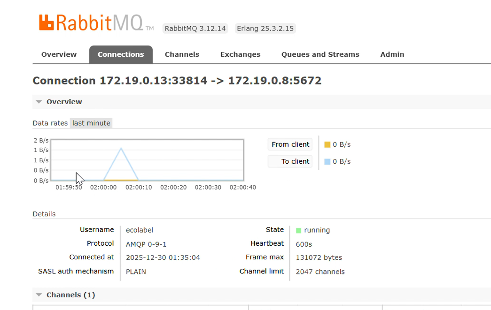
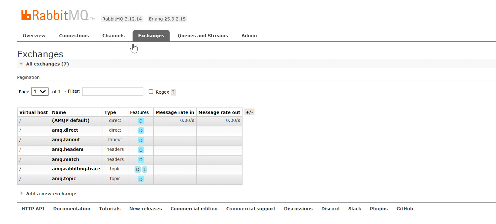
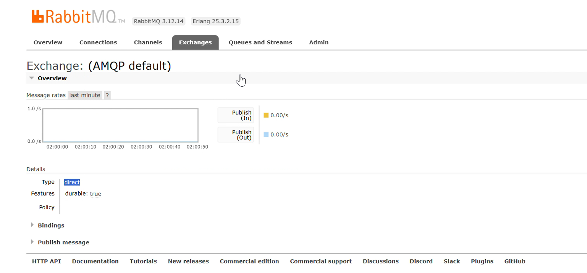
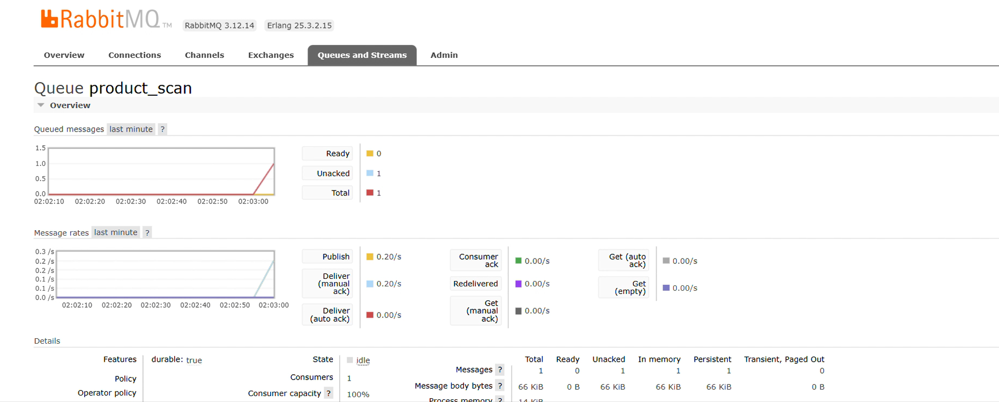

## RabbitMQ Monitoring and Messaging Workflow

The following screenshots illustrate the monitoring and configuration of RabbitMQ used for asynchronous communication between microservices.

### Active Connection

This figure shows an active AMQP connection between a client application and the RabbitMQ broker, confirming that the messaging infrastructure is running correctly.

### Exchanges Configuration

This screenshot presents the list of available exchanges, including the default AMQP exchanges, which are responsible for routing messages to queues based on their type and routing rules.

### Exchange Details

This figure shows the detailed configuration of a direct exchange, including durability and message publish rates.

### Queue Monitoring

This screenshot displays the queue `product_scan`, showing queued messages, delivery status, and consumer activity, which confirms that messages are correctly published and consumed.
# TP29_Microservices
